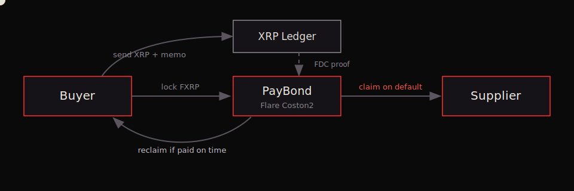
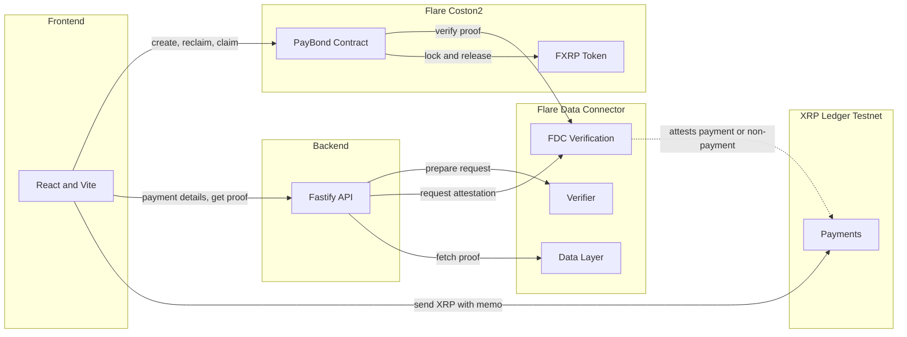
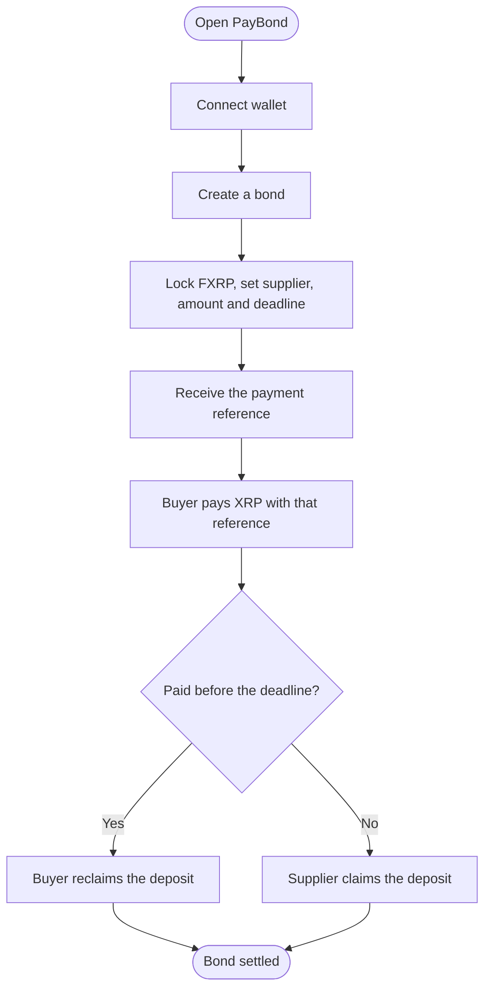

<p align="center">
  
</p>

<p align="center">
  Trustless cross-chain payment guarantees on Flare and the XRP Ledger.
</p>

---

## The Problem

A supplier ships goods and then waits to get paid. If the buyer never pays, the supplier is stuck.

Paying across two different blockchains makes this worse. The buyer holds XRP on one network. The supplier works on another. Today the only way to feel safe is to trust a middleman to watch the payment and step in if something goes wrong.

PayBond removes that middleman.

## How It Works

1. The buyer locks a deposit in FXRP on Flare and gets a payment reference.
2. The buyer pays the supplier in XRP on the XRP Ledger, adding that reference.
3. Pay on time and the buyer gets the deposit back. Miss the deadline and the supplier takes the deposit.

A neutral Flare protocol checks whether the payment happened, so no one has to trust anyone. The same protocol can also prove a payment did not happen, which is what lets the supplier claim the deposit on a default.

## Why Flare

Most payment escrows need a trusted oracle to watch a payment and report back. PayBond does not, because Flare has an enshrined data protocol that most builders overlook: the Flare Data Connector can prove that a specific payment **did not happen** by a deadline.

Everyone else proves a payment happened. PayBond settles on the absence of one. That single primitive is what makes a trustless default path possible, and it is native to Flare.

- **ReferencedPaymentNonexistence** proves the buyer never paid, so the supplier claims the deposit with no arbiter.
- **Payment** proves the buyer did pay on the XRP Ledger, so the buyer reclaims the deposit.
- **FXRP** holds the deposit as a trustless representation of XRP, so value stays inside the Flare and XRPL ecosystem.

No middleman decides the outcome. Flare's protocols do.

## Flow

<p align="center">
  
</p>

## Architecture



## User flow



## Contracts

`PayBond.sol` holds the deposit and settles it against a Flare Data Connector proof. It never trusts a caller's word.

```solidity
function createBond(address payee, bytes32 payeeHash, uint256 amount, uint256 deadline)
    external returns (uint256 bondId, bytes32 reference);

function reclaim(uint256 bondId, IPayment.Proof calldata proof) external;

function claim(uint256 bondId, IReferencedPaymentNonexistence.Proof calldata proof) external;
```

- **createBond** escrows the buyer's FXRP and returns a unique 32 byte `reference`.
- **reclaim** returns the deposit to the buyer once a Payment proof shows the XRP arrived on time with the matching reference.
- **claim** releases the deposit to the supplier once a ReferencedPaymentNonexistence proof shows no such payment arrived by the deadline.

The reference is the key detail. On the XRP Ledger it is carried as a single 32 byte memo, so every bond maps to exactly one payment. A buyer cannot reuse an old payment, and two bonds can never collide.

## Features

- **Bond status tracking.** Every bond moves through clear states so both sides always know where it stands: Funded, Paid, Expired, Reclaimed, Claimed. The state is derived from the deadline and whether payment was detected, and shows as a tag on every card and detail view.
- **Reference binding.** Each bond issues a unique 32 byte reference that binds one-to-one to a single XRP payment. A payment cannot be reused across bonds and cannot be replayed, which removes the most common escrow fraud without any extra checks.
- **Analytics.** A dashboard overview reports FXRP locked, active bonds, total bonds, and default rate, so the health of the system is visible at a glance.
- **Activity feed.** Bond events are surfaced as a live feed: bond created, payment detected, deposit reclaimed, deposit claimed. Each entry links back to its bond.

## Roadmap

- Partial and installment payments for B2B trade.
- A dispute window after the deadline before the supplier can claim.
- Multi-party escrow for one buyer and many suppliers.
- Wiring the interface to the deployed contract and live Flare Data Connector proofs.

## Tech Stack

| Layer | Tech |
|-------|------|
| Blockchain | Solidity, Foundry, Flare periphery contracts |
| Backend | Node, TypeScript, Fastify, viem, xrpl |
| Frontend | React, TypeScript, Vite, wagmi, viem |
| Data | Flare Data Connector: Payment and ReferencedPaymentNonexistence |
| Networks | Flare Coston2, XRP Ledger Testnet |
| Asset | FXRP |

## Project Structure

```
PayBond/
├── blockchain/   Solidity contracts, Foundry
├── backend/      Attestation orchestration API, Node and TypeScript
├── frontend/     Web app, React and Vite
└── assets/       Banner and flow graphics
```

The three code folders are independent. They communicate over the chain and the HTTP API only.

## Getting Started

Blockchain
```
cd blockchain
npm install
forge install foundry-rs/forge-std
forge build
forge test
```

Backend
```
cd backend
npm install
cp .env.example .env
npm run dev
```

Frontend
```
cd frontend
npm install
npm run dev
```

## Networks

Testnets only. Fund Coston2 from the Coston2 faucet and the XRP Ledger from the XRPL testnet faucet. No real funds are used.

## Resources

- Flare Developer Hub: https://dev.flare.network
- Flare Data Connector: https://dev.flare.network/fdc/overview
- ReferencedPaymentNonexistence: https://dev.flare.network/fdc/attestation-types/referenced-payment-nonexistence
- FXRP: https://dev.flare.network/fxrp/overview
- XRP Ledger Testnet: https://testnet.xrpl.org
- Foundry: https://book.getfoundry.sh
- viem: https://viem.sh
- Fastify: https://fastify.dev

## Conventions

- No comments in the codebase.
- Simple names.
- One responsibility per file.
- No imports across the three code folders.
