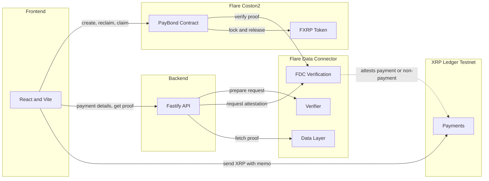
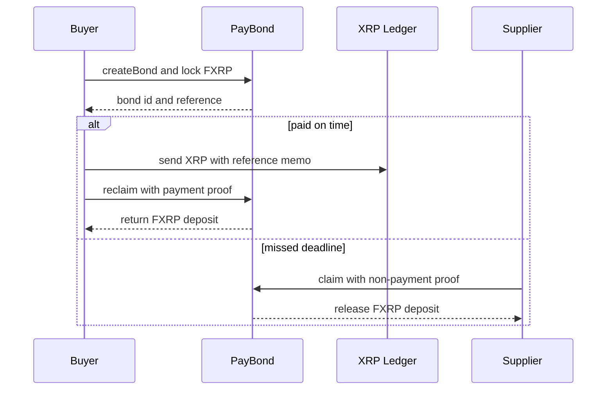

<p align="center">
  
</p>

<p align="center">
  Trustless cross-chain payment guarantees on Flare and the XRP Ledger.
</p>

---

## The Problem

A supplier ships goods and then waits to get paid. If the buyer never pays, the supplier is stuck.

Paying across two different blockchains makes this worse. The buyer holds XRP on one network. The supplier works on another. Today the only way to feel safe is to trust a middleman to watch the payment and step in if something goes wrong.

PayBond removes that middleman.

## How It Works

1. The buyer locks a deposit in FXRP on Flare and gets a payment reference.
2. The buyer pays the supplier in XRP on the XRP Ledger, adding that reference.
3. Pay on time and the buyer gets the deposit back. Miss the deadline and the supplier takes the deposit.

A neutral Flare protocol checks whether the payment happened, so no one has to trust anyone. The same protocol can also prove a payment did not happen, which is what lets the supplier claim the deposit on a default.

## Flow

<p align="center">
  
</p>

## Architecture



## Lifecycle



## Tech Stack

| Layer | Tech |
|-------|------|
| Blockchain | Solidity, Foundry, Flare periphery contracts |
| Backend | Node, TypeScript, Fastify, viem, xrpl |
| Frontend | React, TypeScript, Vite, wagmi, viem |
| Data | Flare Data Connector: Payment and ReferencedPaymentNonexistence |
| Networks | Flare Coston2, XRP Ledger Testnet |
| Asset | FXRP |

## Project Structure

```
PayBond/
├── blockchain/   Solidity contracts, Foundry
├── backend/      Attestation orchestration API, Node and TypeScript
├── frontend/     Web app, React and Vite
└── assets/       Banner and flow graphics
```

The three code folders are independent. They communicate over the chain and the HTTP API only.

## Getting Started

Blockchain
```
cd blockchain
npm install
forge install foundry-rs/forge-std
forge build
forge test
```

Backend
```
cd backend
npm install
cp .env.example .env
npm run dev
```

Frontend
```
cd frontend
npm install
npm run dev
```

## Networks

Testnets only. Fund Coston2 from the Coston2 faucet and the XRP Ledger from the XRPL testnet faucet. No real funds are used.

## Resources

- Flare Developer Hub: https://dev.flare.network
- Flare Data Connector: https://dev.flare.network/fdc/overview
- ReferencedPaymentNonexistence: https://dev.flare.network/fdc/attestation-types/referenced-payment-nonexistence
- FXRP: https://dev.flare.network/fxrp/overview
- XRP Ledger Testnet: https://testnet.xrpl.org
- Foundry: https://book.getfoundry.sh
- viem: https://viem.sh
- Fastify: https://fastify.dev

## Conventions

- No comments in the codebase.
- Simple names.
- One responsibility per file.
- No imports across the three code folders.
